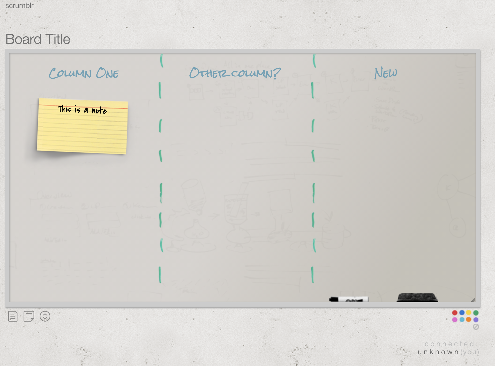

# nodejs_express_API-example
T
his is a simple API that I built to demonstrate how Express works and how to build a simple interaction API.

I built this to help a friend @zainafzal88 ( https://github.com/zainafzal88 ).

To set the context and back story.  I run a meetup called DevCOP  (https://www.meetup.com/DevCoP-Melbourne ).  We use a simple agile board tool called Scrumblr ( http://scrumblr.ca ) it's a cool tool with the soruce code avaliable at ( https://github.com/aliasaria/scrumblr )  As a challenge Zain has set out to convert this to ReactJS, the API to node and move the backend away from Redis as the data store to somehting more longer lasting.  The group suggested a fully serverless solution such as Amazon S3 fronted by Cloudfront, serverless API via lambda, and the data store as DynamoDB.  Thsi will provide scale if required but importantly as a community finded group a low on goign operational price point.

The first part was to assist Zain in setting up the basics of the API in express, how routing works and begin exporing the data model that might be required before we try to incorrectly mash it into DynamoDB in manner that coudl require expensive table scans.

This first iteration uses a homebrew in memory database ( a variable ).  The model only considers:
- Boards ( a board currently has 2 attributes the baordId and an array of notes )
- - Notes, a note has 4 attribues
- - - NoteId
- - - CreatedTime
- - - noteText
- - - location ( x and y coordinates )

For simplcaity UUID's are used for ID's and locations.

This data would be used to represent a board such as the image below.  Of course all this dat arepresents currently is the board and a board that containes zero or many notes.  Take out the additional features and this forms the basics of a columnless whitebboard with stickynotes.



How to run this example?

Clone the repo

```
git clone https://github.com/kukielp/nodejs_express_API-example.git
```

cd into the folder
```
cd nodejs_express_API-example
```

install dependancies
```
npm install
```

run the app
```
node app.js
```

Then interact with the API with a tool such as Postman ( https://www.postman.com/ )

Video example of postman to come.

If you'd like to watch as Zain continues to build out this project as a whole subscribe to his Twitch Channel here https://www.twitch.tv/zainzorro where zain is working throigh this challenge and sharing his knowledge.

If you have questions on this repo fee free to raise an issue.